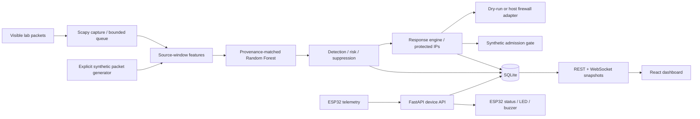

# Updated IoT Work

IoT intrusion detection and automated response, with a working **synthetic demonstration** and a separate, gated live-capture path. This project does not claim that the demonstration model detects arbitrary attacks on real sensors.

## Start

Python 3.13 and Node.js 22+ were used for local verification. From this directory:

```powershell
python -m venv .venv
.\.venv\Scripts\Activate.ps1
python -m pip install -r requirements.txt
python run_demo.py
```

Open http://127.0.0.1:8020. The command trains the demo model, builds the dashboard on first use, and starts a ten-step synthetic sensor/attack/block scenario. Use **Run demo** to repeat it. `python run_demo.py --build` rebuilds changed frontend code. Ctrl+C stops the server. No physical sensor is required.

The standalone project has no runtime dependency on the previous repository. No credentials, databases, incompatible trained artifacts or node_modules were copied from it.

## What Works

- FastAPI REST, one-second WebSocket snapshots, SQLite persistence, React dashboard.
- Device registration and authenticated ESP32 temperature/humidity telemetry.
- Explicit, bounded Scapy capture; source/destination/protocol five-second windows.
- Random Forest inference, explanations as deviations from the training normal median, thresholded risk and duplicate alert suppression.
- Two consecutive qualifying windows trigger temporary, deduplicated response rules.
- Windows Defender Firewall and Linux iptables adapters; **dry-run by default**.
- Demo creates packet objects, runs the actual feature extractor/model/response engine, and rejects subsequent synthetic packets at its admission gate. It does not generate real attack packets.
- Offline labelled-PCAP training with independent-session checks, strict feature schema, evaluation report and an export gate.

## Architecture



## Structure

```text
backend/       API, SQLite, capture service, features, detector, firewall
frontend/      React dashboard and Vite build
ml/            Reproducible demo / labelled-PCAP trainer
sensor/        Preserved ESP32 wiring and telemetry sketch
scripts/       Passive lab-PCAP recorder
tests/         Offline regression tests; no actual firewall changes
docs/          Architecture, ML, demo, security and audit
runtime/       Ignored database, models, generated evaluation
```

## Development

```powershell
python -m ml.train --demo
python -m uvicorn backend.main:create_app --factory --host 127.0.0.1 --port 8020
# separate terminal:
cd frontend
npm ci
npm run dev
```

The dev dashboard is http://127.0.0.1:5175. The API documentation is http://127.0.0.1:8020/docs. Never run multiple backend workers: capture and response ownership are single-process.

```powershell
python -m unittest discover -s tests -v
docker compose up --build
```

Docker is an optional **unverified** dry-run deployment recipe, not a host-firewall deployment. Enter the configured `ADMIN_TOKEN` in the dashboard when using Docker; the example default is `local-demo-change-me`, intended only for loopback demonstration. Change it before sharing access.

## Model and Limits

The installed model is a 100-tree Random Forest trained on generated normal, scan, connection-flood, UDP-burst and connection-retry windows. Its initial 90-window synthetic test set scored 1.0 accuracy, precision, recall, F1, F2, ROC-AUC and average precision. These easily separated generated scenarios are **not real-world accuracy evidence**. See `runtime/demo-model/evaluation.json` for measured latency and complete report.

The old Kitsune/Edge-IIoT artifacts do not match this feature schema and are not silently substituted. Live packets produce `unknown` until a compatible model trained on labelled real captures passes the evaluation gate. Sensor disconnection means stale telemetry, not compromise. Source IP is an observed address, not proof of attacker identity.

**A host firewall does not protect a separate ESP32 on the same Wi-Fi from third-party traffic.** Such enforcement needs a correctly configured gateway/bridge/forwarding adapter, which is not implemented here. Hardware alarm operation, live accuracy, gateway visibility and real OS rule effects remain physical-lab acceptance tests.

## Documentation

- [Architecture and API](docs/ARCHITECTURE.md)
- [ML pipeline and collection](docs/ML_PIPELINE.md)
- [Presentation demo and hardware setup](docs/DEMO.md)
- [Security and firewall operation](docs/SECURITY.md)
- [Audit and remaining work](docs/AUDIT.md)

Screenshot location: `docs/screenshots/` (add verified presentation captures, not mockups).
